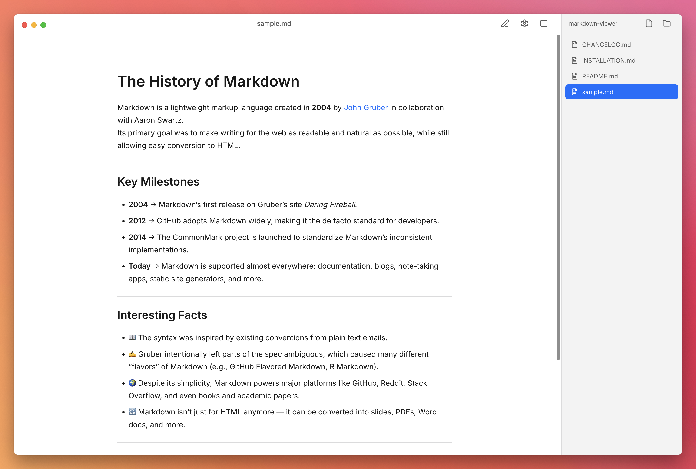
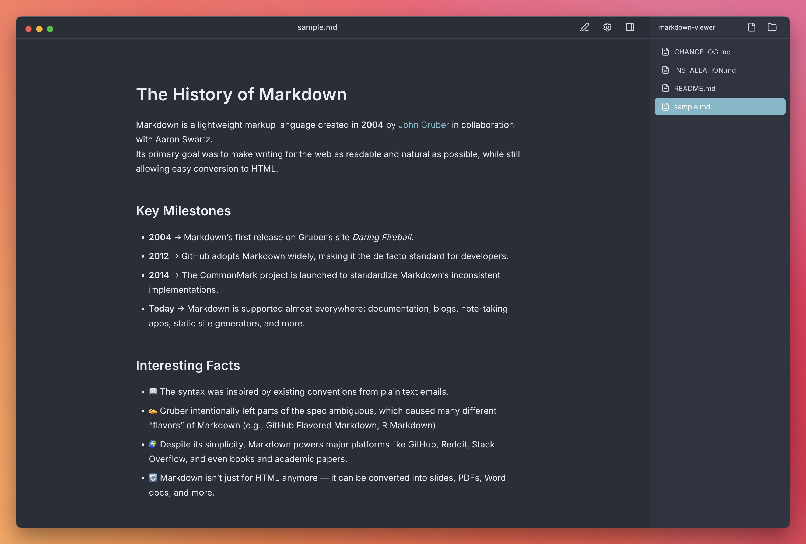
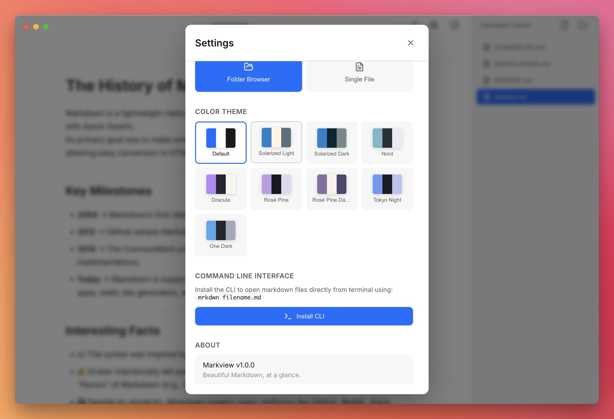
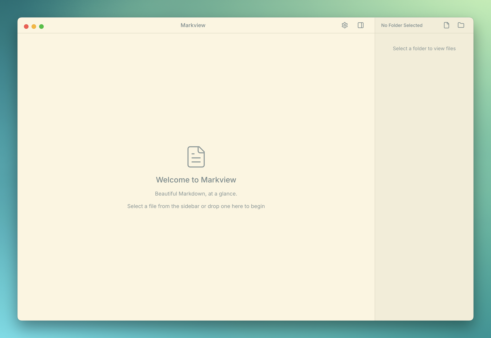

# Markview

<p align="center">
  
</p>

<p align="center">
  <strong>Beautiful Markdown, at a glance.</strong><br>
  A minimalist, elegant markdown viewer and editor for macOS.
</p>

<p align="center">
  
  
  
</p>

<p align="center">
  
</p>

---

## ✨ Features

### Core Features
- **📖 Beautiful Reading Experience** - Clean typography with customizable font pairings
- **✏️ In-Place Editing** - Seamless toggle between view and edit modes
- **🎨 Multiple Themes** - 9 beautiful color themes including Solarized, Nord, Dracula, and more
- **🌓 Dark/Light Mode** - Automatic theme switching based on system preferences
- **📏 Typography Control** - Adjustable font size and 10 curated font pairings

### Performance & Navigation
- **⚡ Lightning Fast** - Instant file switching with intelligent caching
- **🔍 Global Search** - Search across all markdown files in your folder
- **🚀 Quick Open** - Fuzzy file finder (⌘P) like VS Code
- **📑 Table of Contents** - Navigate through document sections with collapsible outline
- **🔎 Search & Replace** - Find and replace with regex support in edit mode
- **📂 Smart Tabs** - Multi-document interface that appears when needed

### Export & Sharing
- **📥 Multi-Format Export** - Export to PDF, HTML, and Word/DOCX
- **📦 Batch Export** - Export multiple files at once
- **🖨️ Print Preview** - Preview before printing with custom styling
- **⚙️ Export Options** - Custom page settings and formatting options

### Advanced Features
- **🎙️ Text-to-Speech** - Natural voices powered by KittenTTS
- **🔄 Auto Updates** - Over-the-air updates with smart notifications
- **🚀 Performance Mode** - Virtual scrolling for large files
- **🔧 Debug Mode** - Performance metrics and developer tools
- **💾 Smart Saving** - Save with ⌘S, with full undo/redo support

### File Management
- **📁 Built-in File Browser** - Navigate folders with a collapsible sidebar
- **🎯 Drag & Drop Support** - Drop files or folders directly onto the app
- **📎 File Association** - Set as default app for `.md` and `.markdown` files
- **📌 Recent Files** - Quick access to recently opened documents

### Markdown Support
- **📊 GitHub Flavored Markdown** - Tables, task lists, strikethrough, and more
- **🧮 LaTeX Math Equations** - Beautiful math rendering with KaTeX
- **📈 Mermaid Diagrams** - Flow charts, sequence diagrams, and more
- **🎨 Syntax Highlighting** - Code blocks with automatic language detection
- **🔗 Smart Links** - Clickable URLs and email addresses

### CLI Support
- **🚀 Command Line Interface** - Open files with `markview filename.md`
- **⚡ Quick Access** - Launch Markview from anywhere in terminal
- **📦 Easy Installation** - Install CLI directly from the app settings

## 📸 Screenshots

### Light Theme
<p align="center">
  
</p>

### Dark Theme
<p align="center">
  
</p>

### Settings & Themes
<p align="center">
  
</p>

### File Browser
<p align="center">
  
</p>

## 🚀 Installation

### Download Release (Recommended)
1. Download the latest `.dmg` from [Releases](https://github.com/yourusername/markview/releases)
2. Open the downloaded DMG file
3. Drag Markview to your Applications folder
4. Launch from Applications (right-click → "Open" on first launch)

### Install via Homebrew (Coming Soon)
```bash
brew install --cask markview
```

### macOS Gatekeeper Issues
If you see "Markview can't be opened because it is from an unidentified developer" or "the file is corrupted" when installing the DMG, this is macOS Gatekeeper blocking the app. To fix this:

1. First try right-clicking the app and selecting "Open"
2. If that doesn't work, run this Terminal command:
```bash
sudo xattr -rd com.apple.quarantine "/Applications/Markview.app"
```

## 📝 Usage

### Opening Files
- **Double-click** any `.md` file (after setting as default app)
- **Drag & drop** files or folders onto the app icon or window
- **Use sidebar** buttons to browse for files or folders
- **Command line**: `markview README.md` (after installing CLI)

### Keyboard Shortcuts

#### Essential
| Action | Shortcut |
|--------|----------|
| Toggle Edit Mode | `⌘E` |
| Save | `⌘S` |
| Undo | `⌘Z` |
| Redo | `⌘⇧Z` |
| Open Settings | `⌘,` |

#### Navigation
| Action | Shortcut |
|--------|----------|
| Quick Open | `⌘P` |
| Global Search | `⌘⇧F` |
| Toggle Table of Contents | `⌘⇧O` |
| Toggle Sidebar | `⌘⌥S` |
| Find & Replace (Edit Mode) | `⌘F` |

#### Tabs
| Action | Shortcut |
|--------|----------|
| Close Tab | `⌘W` |
| Switch to Tab 1-9 | `⌘1` - `⌘9` |

#### Text-to-Speech
| Action | Shortcut |
|--------|----------|
| Read Aloud | `⌘R` |
| Pause/Resume | `Space` |
| Stop Reading | `Esc` |

#### Export
| Action | Shortcut |
|--------|----------|
| Export Document | `⌘⇧E` |

### Editing Workflow
1. Open a markdown file
2. Press `⌘E` to enter edit mode
3. Make your changes with live preview
4. Press `⌘S` to save
5. Press `⌘E` again to return to reading mode

## 🎨 Themes

Markview includes 9 beautiful color themes:
- **Default** (Light/Dark)
- **Solarized** (Light/Dark)
- **Nord**
- **Dracula**
- **Rosé Pine** (Regular/Dawn)
- **Tokyo Night**
- **One Dark**

Access themes via Settings (`⌘,`) → Color Theme

## 🔧 Building from Source

### Prerequisites
- Node.js 16+ and npm
- macOS 10.15 or later
- Xcode Command Line Tools

### Build Steps
```bash
# Clone the repository
git clone https://github.com/yourusername/markview.git
cd markview

# Install dependencies
npm install

# Development mode with hot reload
npm run dev

# Build for production
npm run build

# Package for macOS
npm run dist:mac
```

### Project Structure
```
markview/
├── src/
│   ├── main/           # Electron main process
│   └── renderer/       # React app
├── resources/
│   ├── icons/          # App icons
│   └── cli/            # CLI scripts
├── dist/               # Build output
└── build/              # Packaged apps
```

## 🤝 Contributing

Contributions are welcome! Please feel free to submit a Pull Request. For major changes:

1. Fork the repository
2. Create your feature branch (`git checkout -b feature/AmazingFeature`)
3. Commit your changes (`git commit -m 'Add some AmazingFeature'`)
4. Push to the branch (`git push origin feature/AmazingFeature`)
5. Open a Pull Request

### Development Guidelines
- Follow the existing code style
- Add tests for new features
- Update documentation as needed
- Ensure all tests pass before submitting PR

## 🆕 What's New in v1.1.0

### Typography & Performance Update
- **Font Pairings** - Choose from 10 curated font combinations
- **Lightning Fast** - Instant file switching with caching
- **Virtual Scrolling** - Smooth performance for large files
- **Debug Mode** - Performance metrics and developer tools
- **UI Improvements** - Cleaner interface with smart tab bar

See [CHANGELOG.md](CHANGELOG.md) for full release history.

## 🐛 Known Issues

- Mermaid diagrams may take a moment to render on first load
- Large files (>10MB) may experience slower performance
- Some complex LaTeX equations might need page refresh

## 📜 License

MIT License - see [LICENSE](LICENSE) file for details

## 🙏 Acknowledgments

- Built with [Electron](https://www.electronjs.org/) and [React](https://reactjs.org/)
- Markdown parsing by [remark](https://remark.js.org/)
- Math rendering by [KaTeX](https://katex.org/)
- Diagram support by [Mermaid](https://mermaid-js.github.io/)
- Inspired by [iA Writer](https://ia.net/writer)'s beautiful typography

---

<p align="center">
  <strong>Markview</strong> - Your Markdown. Clear. Themed. Everywhere.<br>
  Made with ❤️ for the markdown community
</p>