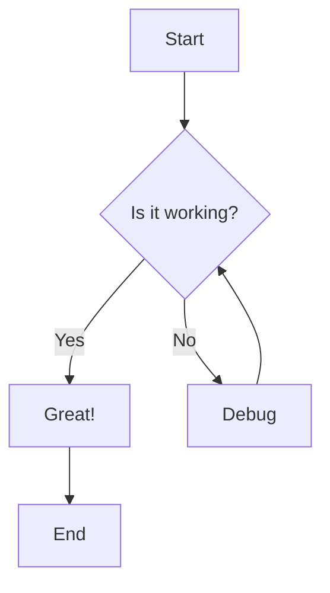
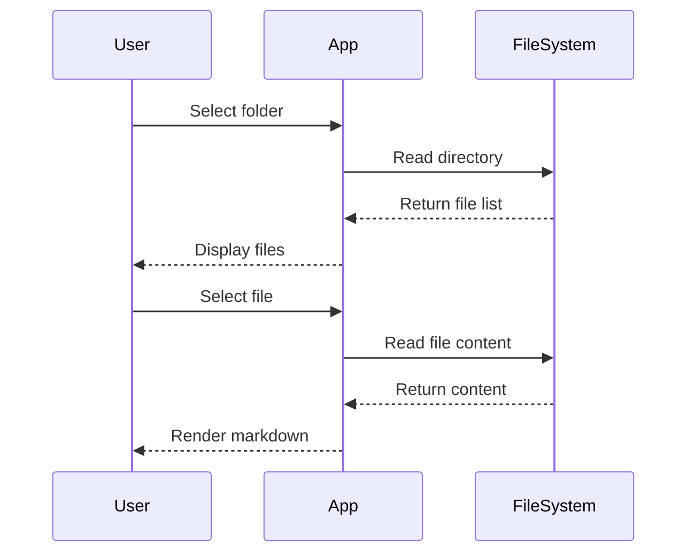

# Markdown Viewer Test Document

This is a test document to showcase the features of our markdown viewer.

## Features

### Text Formatting

You can use **bold text**, *italic text*, and ***bold italic text***. You can also use `inline code` and ~~strikethrough~~.

### Lists

#### Unordered List
- First item
- Second item
  - Nested item
  - Another nested item
- Third item

#### Ordered List
1. First step
2. Second step
   1. Sub-step A
   2. Sub-step B
3. Third step

### Links and Images

[Visit GitHub](https://github.com)

### Code Blocks

```javascript
function greet(name) {
  console.log(`Hello, ${name}!`);
  return `Welcome to the markdown viewer`;
}

const result = greet('World');
```

```python
def fibonacci(n):
    if n <= 1:
        return n
    return fibonacci(n-1) + fibonacci(n-2)

# Calculate the 10th Fibonacci number
print(fibonacci(10))
```

### Tables

| Feature | Status | Priority |
|---------|--------|----------|
| GFM Support | ✅ | High |
| Math Rendering | ✅ | Medium |
| Mermaid Diagrams | ✅ | High |
| Syntax Highlighting | ✅ | High |

### Blockquotes

> "The best way to predict the future is to invent it."
> 
> — Alan Kay

### Math Equations

Inline math: $E = mc^2$

Block math:
$$
\frac{d}{dx} \int_{a}^{x} f(t) \, dt = f(x)
$$

### Mermaid Diagrams





### Task Lists

- [x] Create Electron app
- [x] Add React frontend
- [x] Implement markdown parsing
- [x] Add syntax highlighting
- [ ] Add search functionality
- [ ] Add export options

---

This document demonstrates all the key features supported by the markdown viewer.